# W9 Evidence - GitOps, Observability, Canary và Alert Email

Tài liệu này ghi lại bằng chứng cho lab/challenge W9: GitOps, quan sát hệ thống, SLO alert, canary auto-abort, rollback và gửi cảnh báo qua email.

## Kết Quả Dự Án

| Yêu cầu | Trạng thái | Bằng chứng |
| --- | --- | --- |
| Deploy bằng GitOps qua ArgoCD | Đạt | ArgoCD quản lý `root`, `web`, `kube-prometheus-stack`, `argo-rollouts` |
| API riêng theo Lab 3 | Đạt | Có ArgoCD Application `api`, `k8s-api/`, Rollout `api`, Service `api`, ServiceMonitor `api` |
| Cài Prometheus/Grafana/Alertmanager bằng GitOps | Đạt | Các pod monitoring đang Running |
| Cài Argo Rollouts bằng GitOps | Đạt | Pod Argo Rollouts controller đang Running |
| Ứng dụng có metrics | Đạt | Backend expose endpoint `/metrics` |
| Prometheus scrape được metrics của app | Đạt | Prometheus query trả về metrics backend |
| Có SLO alert | Đạt | Rule `BackendHighErrorRate` hiển thị trong Prometheus |
| Alert firing và gửi email | Đạt | Có ảnh alert firing và email nhận được |
| Canary bản tốt chạy thành công | Đạt | AnalysisRun Successful, Rollout Healthy |
| Canary bản lỗi tự abort | Đạt | AnalysisRun Failed, RolloutAborted |
| Rollback bằng Git | Đạt | Có bằng chứng `git revert` |
| Trạng thái cuối đã restore | Đạt | Backend đã đưa về `ERROR_RATE=0`, ArgoCD về `Synced / Healthy` |

## Thư Mục Ảnh

Tất cả ảnh bằng chứng được lưu trong:

```text
cloud/w9/lab/evidence/
```

## 1. ArgoCD Applications

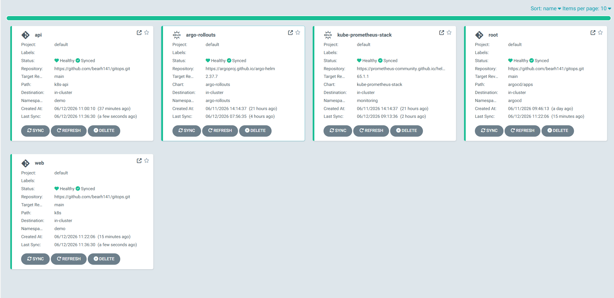

Ảnh này chứng minh ArgoCD đang quản lý các application cần thiết:

- `root`
- `web`
- `api`
- `kube-prometheus-stack`
- `argo-rollouts`

`root` là application gốc theo mô hình app-of-apps. Nó tự tạo các application con từ thư mục `argocd/apps`.

## 2. Monitoring Stack Running

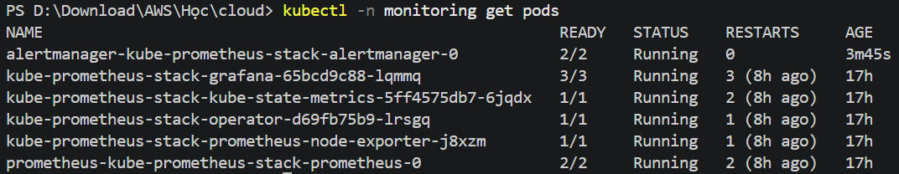

Ảnh này chứng minh monitoring stack đang chạy trong namespace `monitoring`.

Các thành phần cần có:

- Alertmanager
- Grafana
- Prometheus
- Prometheus Operator
- kube-state-metrics
- node-exporter

## 3. Argo Rollouts Controller Running

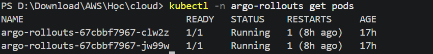

Ảnh này chứng minh Argo Rollouts controller đang chạy.

Controller này cần thiết để xử lý các resource:

- `Rollout`
- `AnalysisTemplate`
- `AnalysisRun`

## 4. Demo Namespace Resources

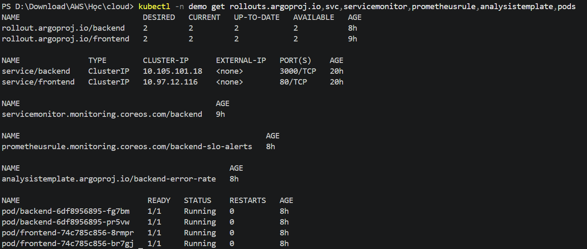

Ảnh này chứng minh namespace `demo` có đủ các resource chính của bài:

- `Rollout/backend`
- `Rollout/frontend`
- `Rollout/api`
- `Service/backend`
- `Service/frontend`
- `Service/api`
- `ServiceMonitor/backend`
- `ServiceMonitor/api`
- `PrometheusRule/backend-slo-alerts`
- `AnalysisTemplate/backend-error-rate`
- Pod backend/frontend

## 4b. API Riêng Theo Đúng Lab 3

Phần này bổ sung đúng yêu cầu Lab 3 trong đề: tạo API riêng thay vì chỉ gộp vào app `web/backend`.

Các file đã tạo:

```text
cloud/w9/lab/gitops/app/api/app.py
cloud/w9/lab/gitops/app/api/Dockerfile
cloud/w9/lab/gitops/k8s-api/api.yaml
cloud/w9/lab/gitops/k8s-api/servicemonitor.yaml
cloud/w9/lab/gitops/argocd/apps/api.yaml
```

Lệnh kiểm tra:

```powershell
kubectl -n argocd get app api
kubectl -n demo get rollout api
kubectl -n demo get svc api
kubectl -n demo get servicemonitor api
kubectl -n demo get pods -l app=api
```

Kết quả đã xác nhận:

```text
api    Synced    Healthy
rollout/api    4/4 available
service/api    8080/TCP
servicemonitor/api
api pods       Running
```

Prometheus query đã có dữ liệu:

```promql
flask_http_request_total{namespace="demo"}
```

Kết quả đã xác nhận Prometheus thấy metric từ API:

```text
job="api"
service="api"
namespace="demo"
status="200"
```

Ảnh nên bổ sung nếu cần nộp sát đề Lab 3:

```text
evidence/04b-api-application-healthy.png
evidence/04c-api-prometheus-metric.png
```

## 5. Web Application Running


Ảnh này chứng minh web app có thể truy cập được và có thể gọi backend service.

Frontend không phải trọng tâm chính của challenge. Frontend chỉ dùng để tạo request đến backend, từ đó backend sinh metrics cho Prometheus.

## 6. Backend Metrics Endpoint


Ảnh này chứng minh backend expose metrics theo định dạng Prometheus.

Các metric quan trọng:

```text
gitops_demo_requests_total
gitops_demo_http_requests_total
gitops_demo_build_info
```

Challenge dùng metric `gitops_demo_http_requests_total` để tính error rate của backend.

## 7. Prometheus Query

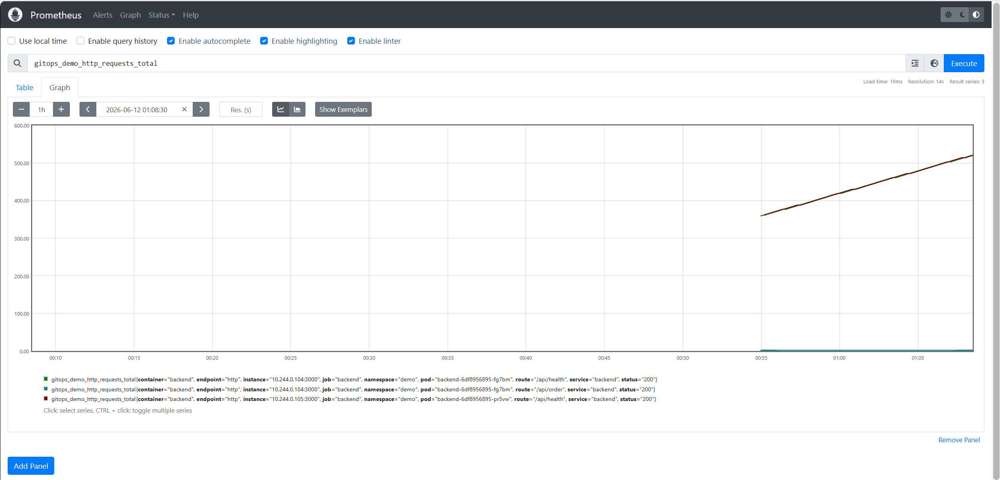

Ảnh này chứng minh Prometheus scrape và query được metrics từ backend.

Metric chính:

```promql
gitops_demo_http_requests_total
```

Query tính error rate/SLO:

```promql
(sum(increase(gitops_demo_http_requests_total{namespace="demo",route="/api/order",status=~"5.."}[1m])) or vector(0))
/
clamp_min((sum(increase(gitops_demo_http_requests_total{namespace="demo",route="/api/order"}[1m])) or vector(0)), 1)
```

## 8. Prometheus Alert Rule

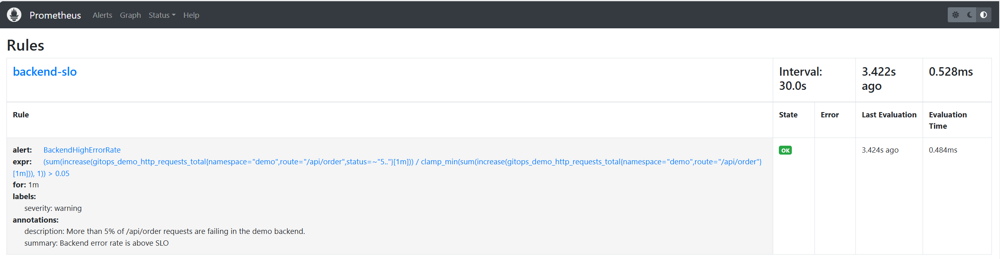

Ảnh này chứng minh alert rule theo SLO đã tồn tại trong Prometheus.

Tên alert:

```text
BackendHighErrorRate
```

SLO:

```text
Error rate của /api/order phải nhỏ hơn 5%
```

Alert sẽ firing khi error rate lớn hơn `0.05` liên tục trong `1m`.

## 9. Canary Bản Tốt


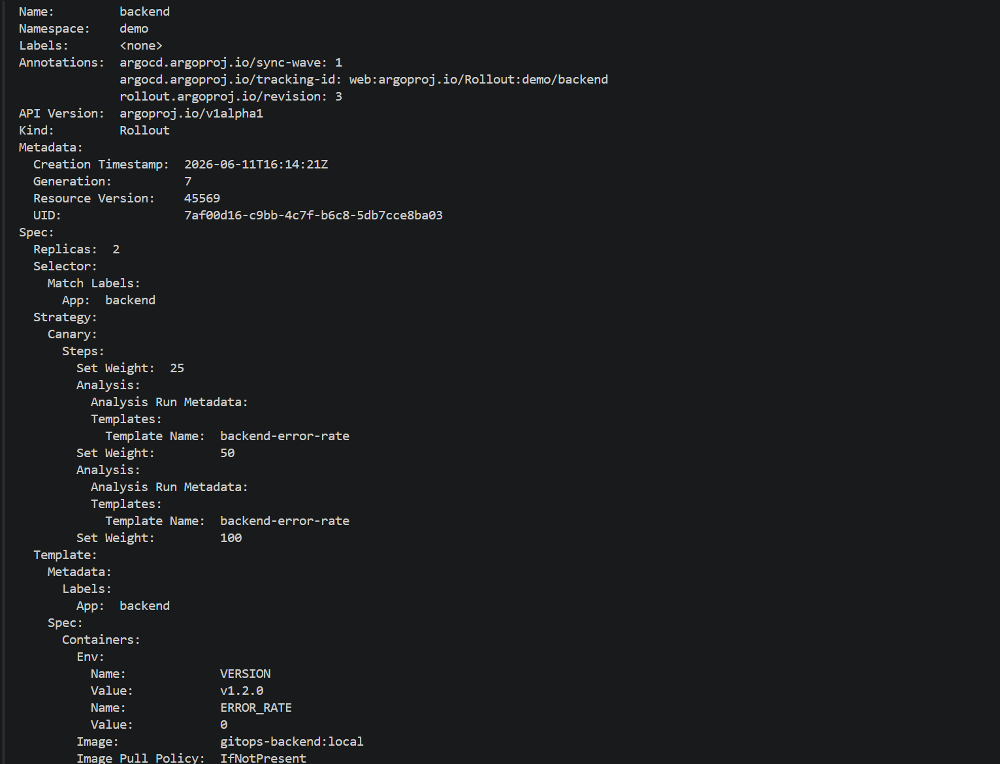


Các ảnh này chứng minh bản backend tốt đã pass canary analysis.

Kết quả mong đợi:

```text
AnalysisRun Successful
Rollout Healthy
RolloutCompleted
Stable ReplicaSet chuyển sang bản mới
```

Trường hợp này xảy ra khi backend được cấu hình:

```yaml
ERROR_RATE: "0"
```

## 10. Canary Bản Lỗi Auto-Abort

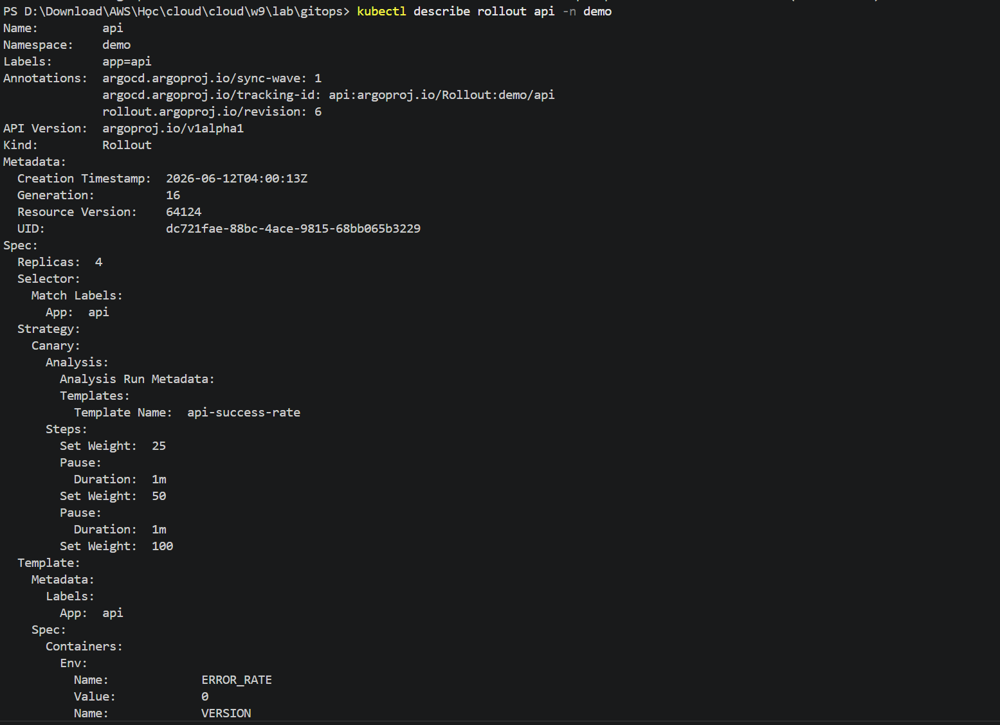
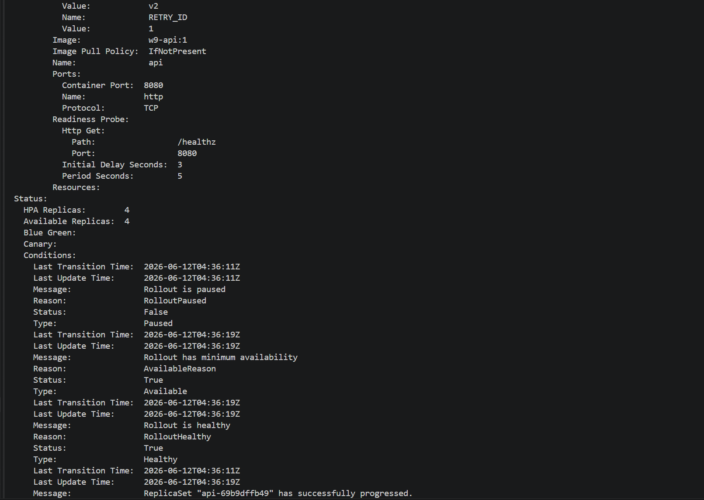
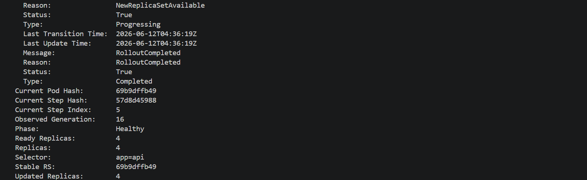
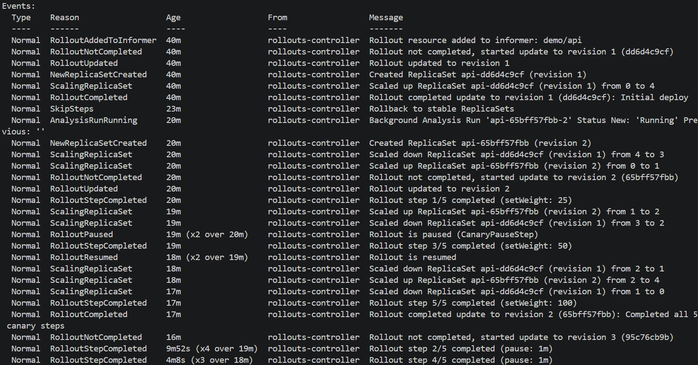

Các ảnh này chứng minh bản backend lỗi đã bị tự động abort.

Kết quả mong đợi:

```text
AnalysisRun Failed
RolloutAborted
Rollout Phase: Degraded
Stable ReplicaSet vẫn giữ bản healthy trước đó
```

Trường hợp này xảy ra khi backend được cấu hình:

```yaml
ERROR_RATE: "0.5"
```

Bản lỗi tạo quá nhiều HTTP 500, làm Prometheus query tính error rate vượt ngưỡng SLO.

## 11. Git Revert Rollback


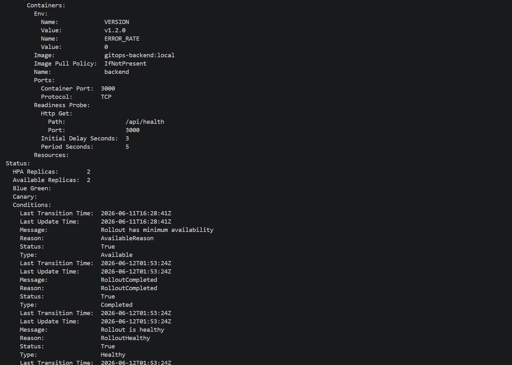

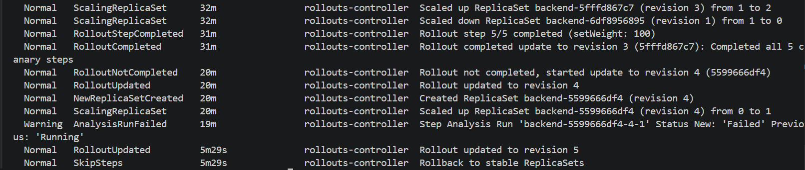

Các ảnh này chứng minh rollback được thực hiện bằng Git, không sửa tay trực tiếp trên cluster.

Mẫu lệnh rollback:

```powershell
git log --oneline
git revert <bad-commit-id> --no-edit
git push
```

Sau khi commit revert được push lên GitHub, ArgoCD sync cluster về trạng thái mong muốn trong Git.

## 12. Alert Firing và Email Nhận Được

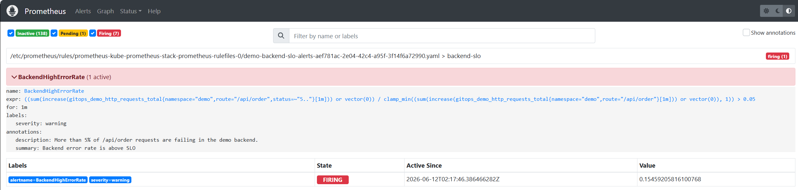
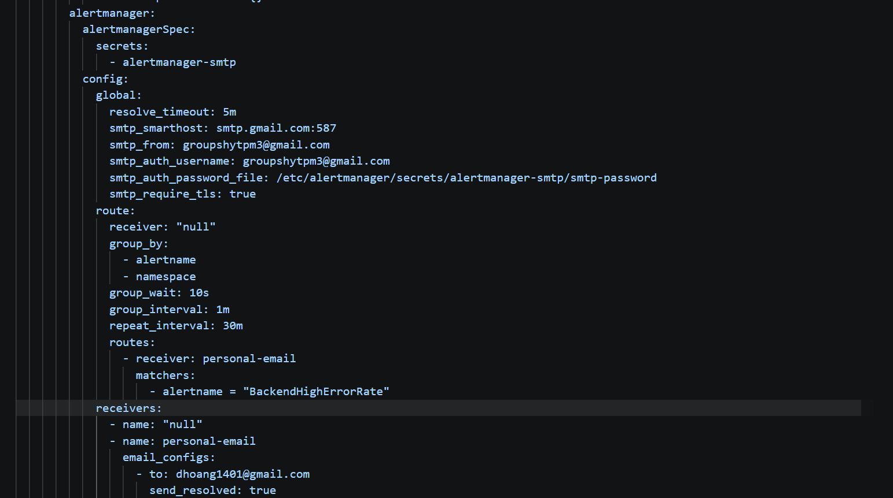


Các ảnh này chứng minh:

- Alert `BackendHighErrorRate` đã chuyển sang trạng thái firing.
- Alertmanager route alert đến email receiver.
- Email cảnh báo đã được nhận thành công.

Email receiver được cấu hình trong:

```text
cloud/w9/lab/gitops/argocd/apps/kube-prometheus-stack.yaml
```

SMTP password được lưu trong Kubernetes Secret và không được commit lên Git.

## 13. Trạng Thái Cuối Healthy

Sau khi demo bản lỗi và email alert, backend đã được restore về cấu hình healthy:

```yaml
VERSION: "v1.8.0"
ERROR_RATE: "0"
```

Lệnh kiểm tra cuối:

```powershell
kubectl -n argocd get app web
kubectl -n demo get rollout backend
kubectl -n demo describe rollout backend
```

Kết quả mong đợi:

```text
web    Synced    Healthy
backend Phase: Healthy
Stable RS: 66dd8ffb9f
```

Nếu cần bổ sung ảnh trạng thái cuối, đặt tên:

```text
evidence/13-final-web-synced-healthy.png
```

## Lệnh Kiểm Tra Lại

Dùng các lệnh sau để tái kiểm chứng:

```powershell
kubectl -n argocd get applications
kubectl -n monitoring get pods
kubectl -n argo-rollouts get pods
kubectl -n demo get rollouts.argoproj.io,svc,servicemonitor,prometheusrule,analysistemplate,pods
kubectl -n demo get analysisrun
kubectl -n demo describe rollout backend
kubectl -n monitoring get secret alertmanager-smtp
```

## Ghi Chú Bảo Mật

Không commit file secret thật:

```text
cloud/w9/lab/gitops/k8s/alertmanager-smtp-secret.yaml
```

Chỉ commit file mẫu:

```text
cloud/w9/lab/gitops/k8s/alertmanager-smtp-secret.example.yaml
```

File mẫu phải giữ giá trị placeholder:

```yaml
smtp-password: REPLACE_WITH_GMAIL_APP_PASSWORD
```

## Tóm Tắt Luồng Đã Chứng Minh

Bộ evidence này chứng minh đầy đủ luồng challenge W9:

```text
Git change
  -> ArgoCD sync
  -> Rollout canary
  -> Prometheus phân tích metric
  -> bản tốt được promote
  -> bản lỗi bị auto-abort
  -> Prometheus alert firing
  -> Alertmanager gửi email
  -> rollback bằng Git
```
